## Capitulo 2 - Projetando banco de dados

Antes da criação do banco de dados ou iniciarmos a utilização dos comandos SQL. O livro aborda um assunto de extrema importancia: Planejamento de um banco de dados.

Em resumo, existem estudos que indicam que quanto maior o tempo despendido no desenho do banco de dados, menor será o tempo despendido na manutenção do modelo. Então esse desenho é de extrema importancia para a estabilidade de todo o sistema, evitando futuramente um comprometimento de todo o desenvolvimento.

Podemos comparar o planejamento do banco de dados com uma estrutura de um prédio. Se não for dado a devida atenção, o edifício irá cair.

*Conforme apresentado no livro, iremos realizar os primeiros exercícios fazendo a criação das entidades e seus relacionamentos.*

------

### Exercícios propostos

#### 1.
**Veja os modelos de dados a seguir. Identifique os relacionamentos entre as entidades apresentadas. Leve em consideração que o Gênero é Drama, Comédia, Aventura etc. e Categoria é a faixa de preço do filme. Em um modelo mais completo, deveria haver várias fitas para um mesmo filme, mas imagine que, nesse sistema não haja essa necessidade.**

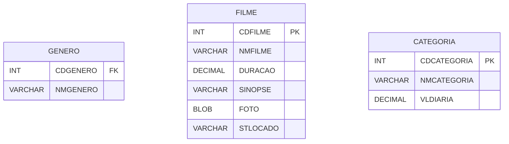

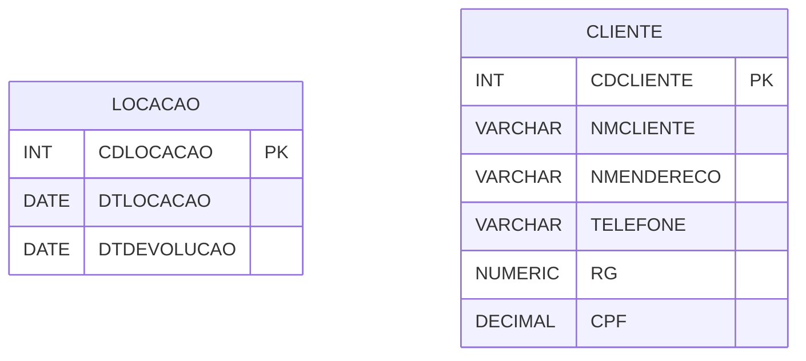

##### Resposta
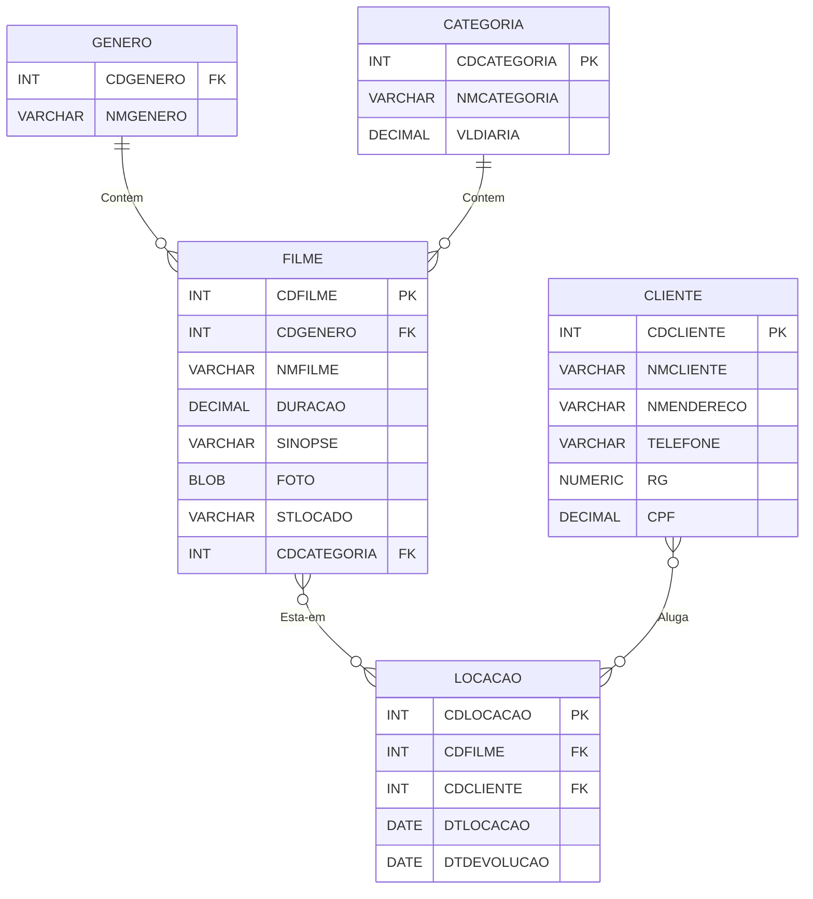

#### 2.
**Complete os relacionamentos a seguir, levando em consideração que esse sistema é utilizado para cadastrar pessoas interessadas em vender e comprar imóveis. Portando, imagine que há apenas um vendedor para cada imóvel, mas que vários compradores podem fazer oferta para o mesmo imóvel. Leve em consideração que o imóvel será posteriormente pesquisado por Estado, Cidade, Bairro e Faixa de Preço. Por esse motivo, não há necessidade de relacionar Estado, Cidade e Bairro com o Vendedor e Comprador. Acrescente um relacionamento para a indicação de outro Imóvel. Note que a Faixa do Imóvel representa a faixa de preço dos imóveis e que, portando, não é um relacionamento que pode ser feito diretamente à tabela Imóvel.**

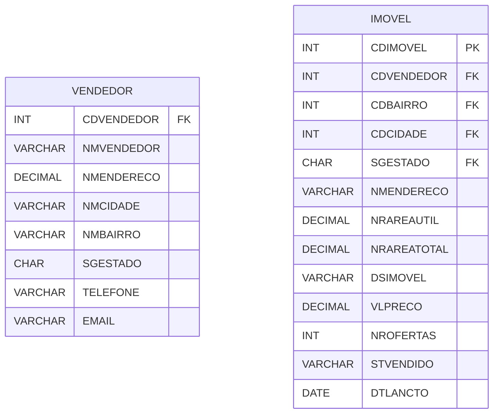

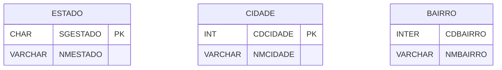

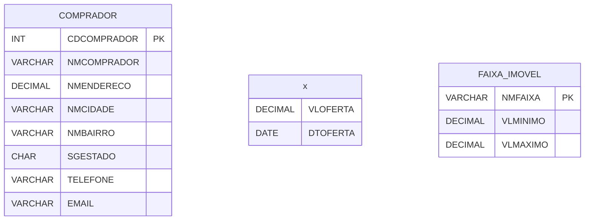

##### Resposta

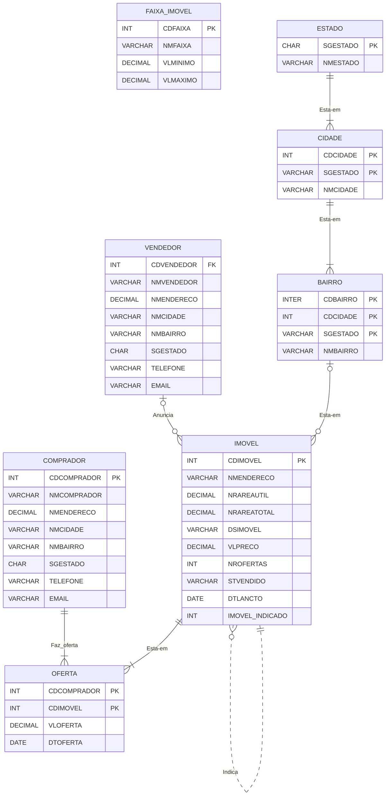

### 3
**Relacione as entidades a seguir e acrescente atributos que você julgue importantes para o sistema. Nesse caso, trata-se de uma empresa de instalação de acessórios para automóveis e, portando, o cliente leva o seu automóvel para instalar produtos na loja.**

##### Resposta

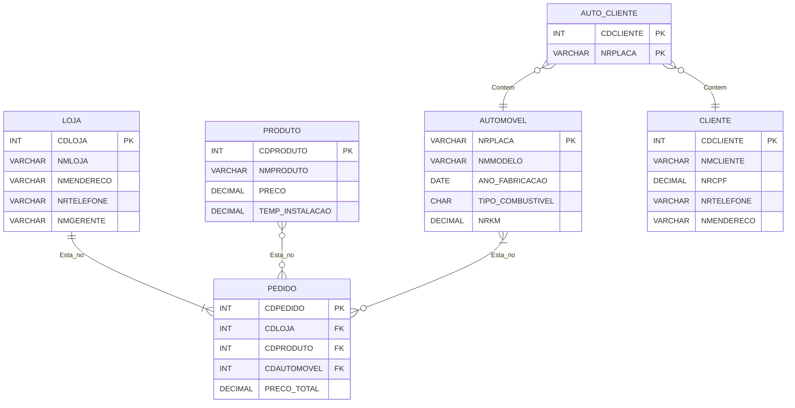

### 4
**Com base nos escopos a seguir, crie um modelo de Entidade X Relacionamento para cada sistema:**

- A) Sou gerente de uma empresa de treinamento que ministra vários cursos técnicos. Esses cursos são identificados por código, nome, e tempo de duração. Montamos turmas com base nos cursos que oferecemos. As turmas têm dias fixos da semana, que identificamos como uma letra (S para segunda-quarta-sexta, T para terça-quinta e B para sábado), um horário específico para início e fim, e um preço. Um instrutor pode dar aulas para várias turmas e nós não trocamos os respectivos instrutores enquanto durar o curso de uma turma. É importante saber o nome, o endereço e o telefone de cada instrutor. Os alunos estão sempre vinculados a uma turma. Devemos saber o nome, o endereco e o telefone de cada aluno.

##### Resposta

> Obs.: Criei a entidade (cronograma) para que futuramente possa ser feito consultas, com o intuito de verificar os dias das siglas. Pensando também na possibilidade de serem criadas siglas no futuro.*

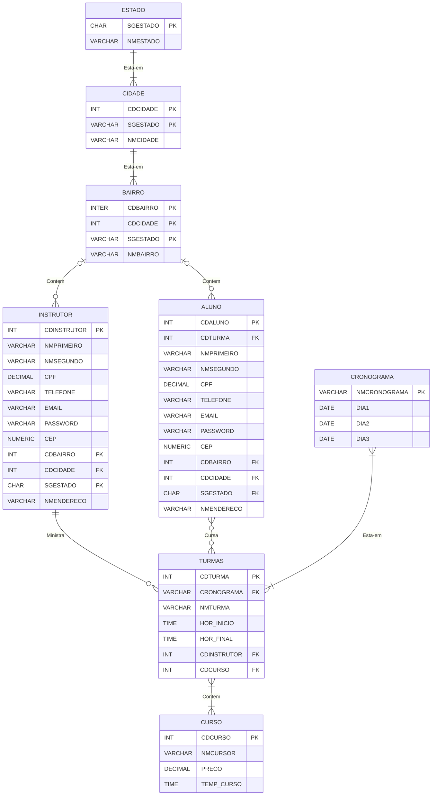

- B) Sou um gerente de Recursos Humanos. Preciso manter informações de cada funcionário da empresa. As informações de cada funcionário de que necessito são: o primeiro nome, o último nome, a função, a data de admissão e o salário. Caso o funcionário seja comissionado, preciso saber o valor médio da comissão. A empresa é dividida em departamento. Cada funcionário é alocado em um departamento. Preciso saber o nome do departamento e sua localização. Alguns funcionários são também gerentes, portando preciso saber qual o gerente de cada funcionário. Note que o próprio gerente é também um funcionário

##### Resposta

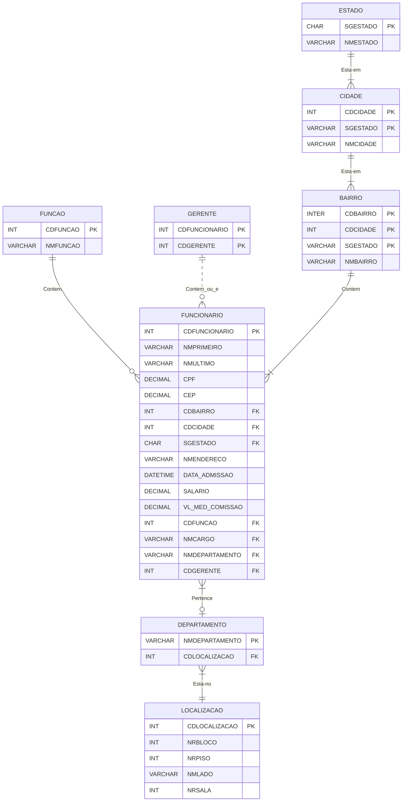

- C) Possuo um site na Internet onde tentamos resolver questões relacionadas com informática. Para facilitar a localização das questões, segmentamos as dúvidas por plataforma e área de interesse. A partir daí, localizamos os eventos relacionados com essa plataforma (como Windows, Unix, Linux) e esse segmento (como pacotes prontos Office Entre outros, sistema operacional, linguagens de programação). Com essas informações, podemos buscar os eventos relacionados à plataforma e ao segmento para mostrar ao usuário. Nos eventos armazenamos a data da ocorrência, a descrição do problema e da solução apresentada, além do usuário que levantou a dúvida. Outros usuários podem fazer comentários (um texto livre) sobre os eventos apresentados. Cadastramos todos os usuários com o nome, o endereço e o telefone. Cadastramos também os consultores que respondem as questões. Precisamos saber o nome, o endereço e o telefone dos consultores.

##### Resposta

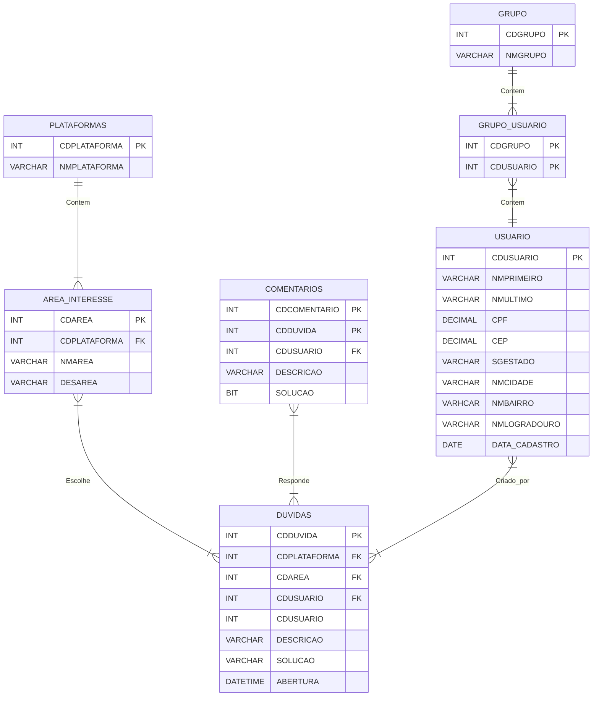