## Chapter 2 - Designing database

Before creating the database or starting to use SQL commands. The book addresses an extremely important subject: Planning a database.

In summary, there are studies that indicate that the more time spent on database design, the less time spent on model maintenance. Therefore, this planning is extremely important for the stability of the entire system, avoiding future development problems.

We can compare database planning with a building structure. If not given proper attention, the building will collapse.

*As presented in the book, we will perform the first exercises by doing an ERDiagram*

------

### Proposed exercises

#### 1.
**See data models below. Identify the relationships between the entities presented. Take into account that the Genre is Drama, Comedy, Adventure, etc. and Category is the price range of the movie. In a more complete model, there should be several tapes for the same film, but imagine that, in this system, there is no such need.**

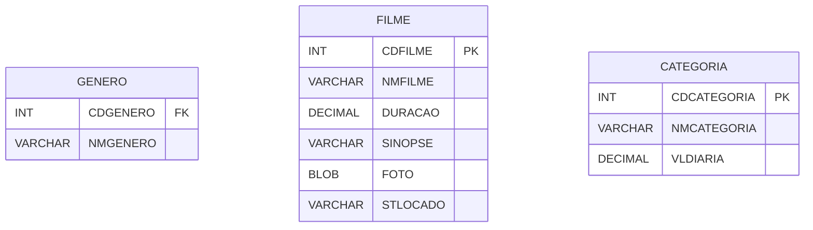

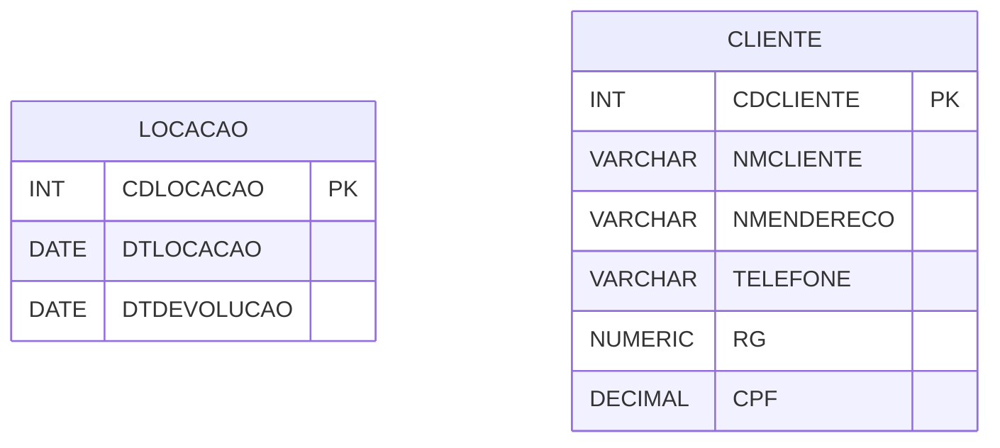

##### REPLY
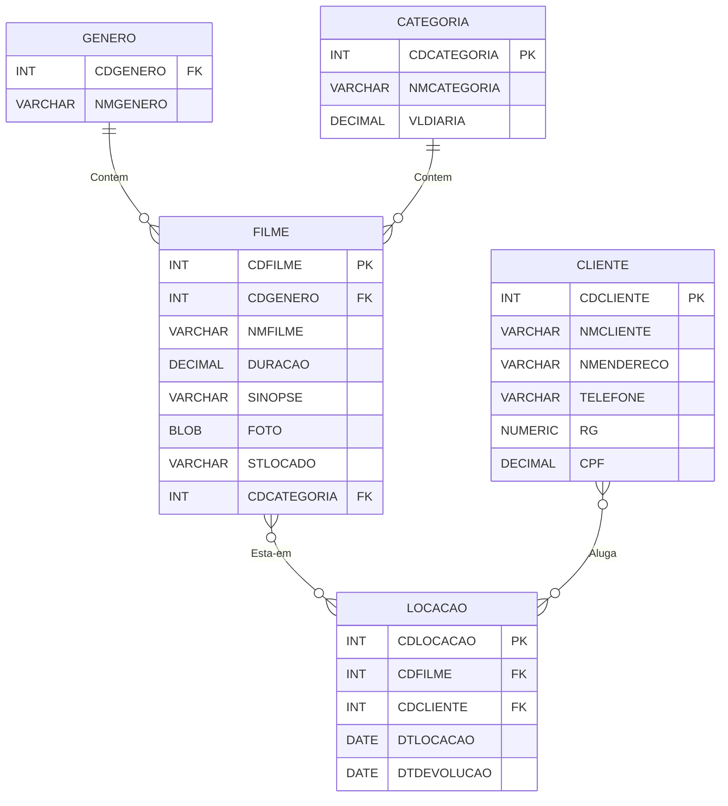

&#xa0;

#### 2.
**Fill in the following relationships, taking into account that this system is used to register people interested in selling and buying properties. So imagine that there is only one seller for each property, but that multiple buyers can bid on the same property. Take into account that the property will be later searched by State, City, Neighborhood and Price Range. For this reason, there is no need to relate State, City and Neighborhood with Seller and Buyer. Add a relation that points to another Property. Note that the entity (FAIXA_IMOVEL) represents the price range of the property. And therefore it is not a relationship that can be made directly with the properties entity.**

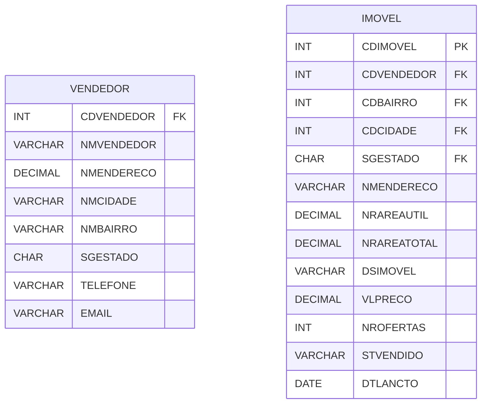

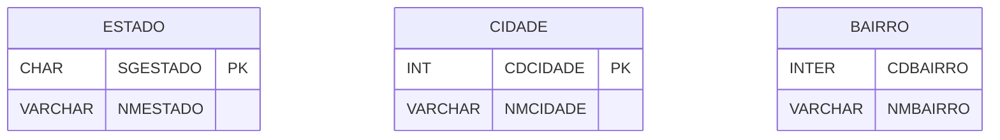

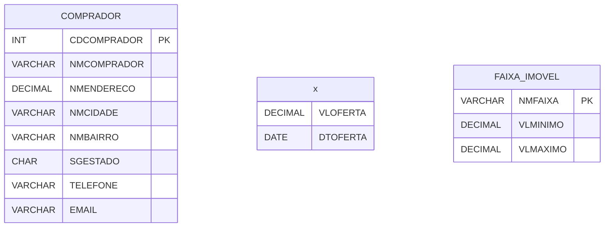

##### REPLY

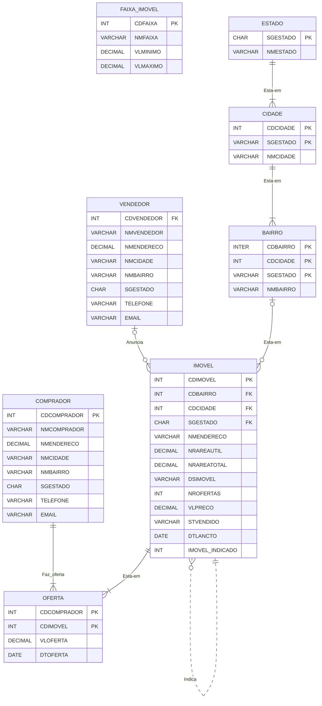

&#xa0;

### 3
** Add attributes that you consider important to the entities below. In this exercise, you are an auto accessories installation company, so the customer takes his car to install the products in the store.**

##### REPLY

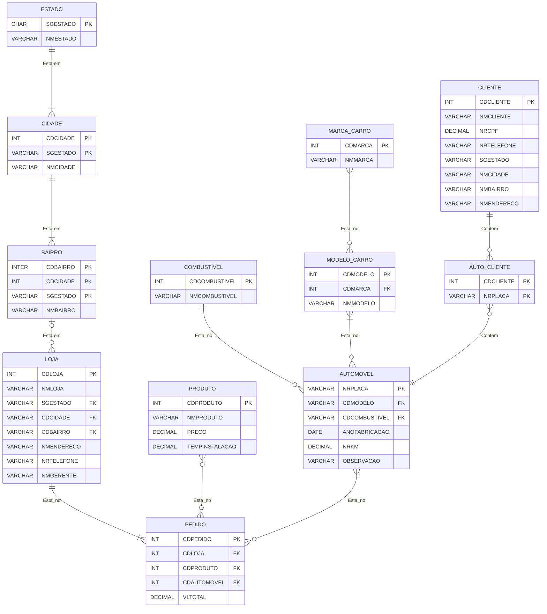

&#xa0;

### 4

**Based on the following scopes, create an Entity X Relationship model for each system:**

- ##### 4ᴬ) I am the manager of a training company that teaches several technical courses. These courses are identified by code, name, and duration. We set up classes based on the courses we offer. Classes have fixed days of the week, which we identify as a letter (S for Monday-Wednesday-Friday, T for Tuesday-Thursday, and B for Saturday), a specific start and end time, and a price. One instructor can teach multiple classes and we do not change instructors for the duration of a class. It is important to know the name, address and telephone number of each instructor. Students are always linked to a class. We must know the name, address and telephone number of each student.

##### REPLY

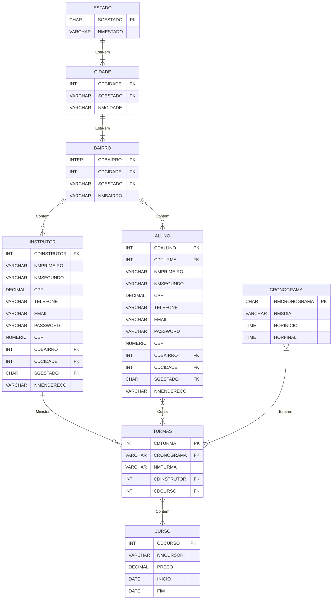

&#xa0;

- ##### 4ᴮ) I'm a Human Resources manager. I need to keep information of every employee in the company. The information for each employee I need is: first name, last name, role, hire date and salary. If the employee is commissioned, I need to know the average commission amount. The company is divided into department. Each employee is allocated to a department. I need to know the name of the department and its location. Some employees are also managers, so I need to know which manager each employee is. Note that the manager himself is also an employee

##### REPLY

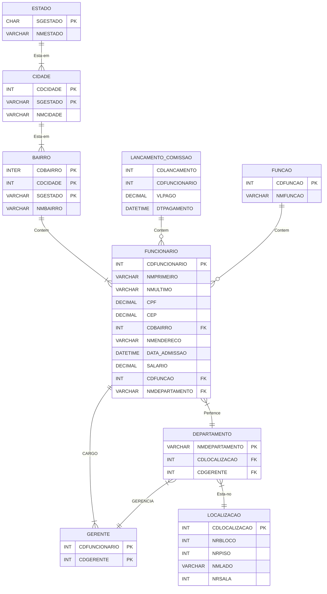

&#xa0;

- ##### 4ᶜ) I have a website where we try to solve computer related problems. To make questions easier to find, we've segmented questions by platform and segment. From there, we find the events related to that platform (such as Windows, Unix, Linux) and with the segments (such as Office packages ready, among others, operating system, programming languages). With this information, we can fetch the events related to the platform and the segment to show the user. In the events, we store the date of occurrence, the description of the problem and the solution presented, in addition to the user who raised the issue. Other users can make comments (a free text) about the presented events. We register all users with their name, address and telephone number. We also record the consultants who answer the questions. We need to know the name, address and telephone number of the consultants.

##### REPLY

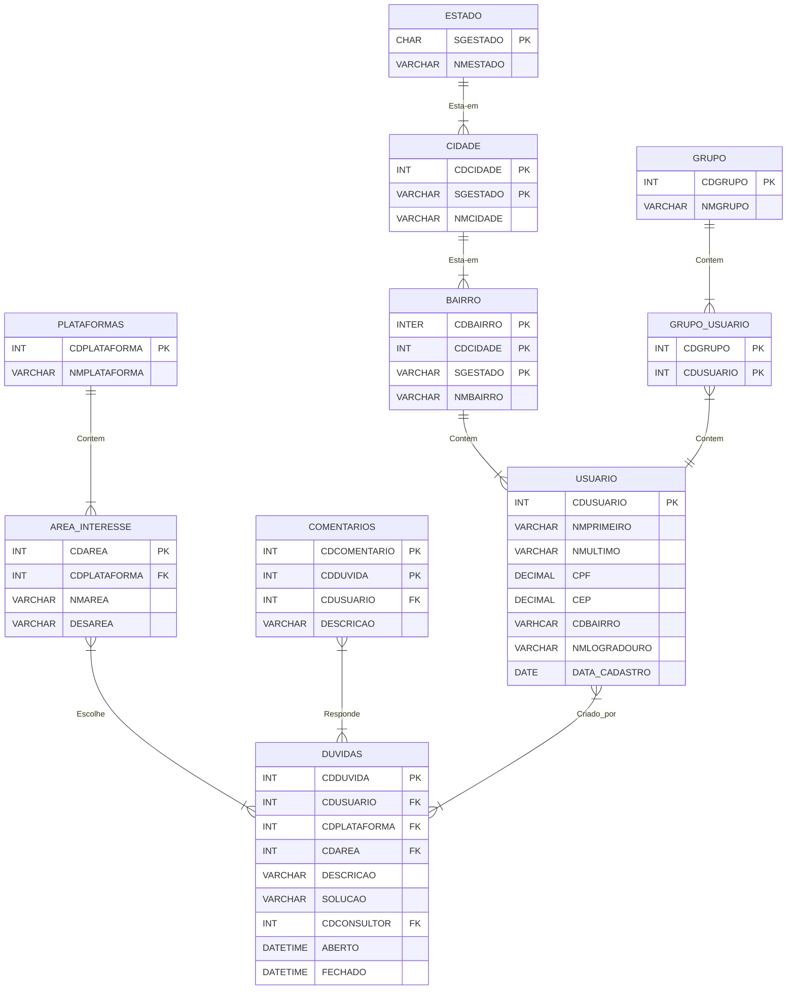