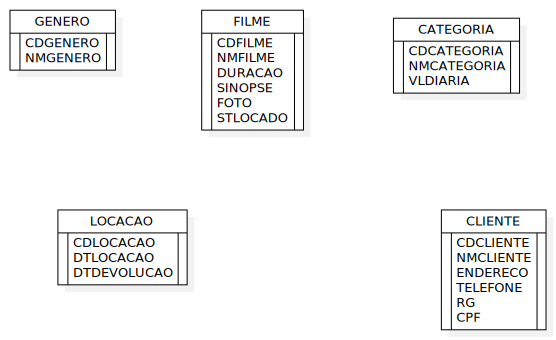
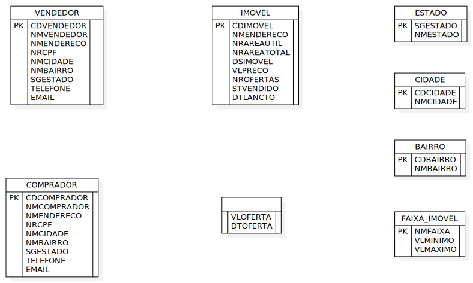
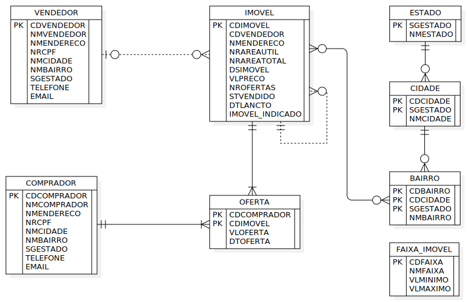

## Capitulo 2 - Projetando banco de dados

Antes da criação do banco de dados ou iniciarmos a utilização dos comandos SQL. O livro aborda um assunto de extrema importancia: Planejamento de um banco de dados.

Em resumo, existem estudos que indicam que quanto maior o tempo despendido no desenho do banco de dados, menor será o tempo despendido na manutenção do modelo. Então esse desenho é de extrema importancia para a estabilidade de todo o sistema, evitando futuramente um comprometimento de todo o desenvolvimento.

Podemos comparar o planejamento do banco de dados com uma estrutura de um prédio. Se não for dado a devida atencão, o edifício irá cair.

------

### Exercícios propostos

## 1.
Veja os modelos de dados a seguir. Identifique os relacionamentos entre as entidades apresentadas. Leve em consideração que o Gênero é Drama, Comédia, Aventura etc. e Categoria é a faixa de preço do filme. Em um modelo mais completo, deveria haver várias fitas para um mesmo filme, mas imagine que, nesse sistema não haja essa necessidade.
   

**Resposta**

## 2. 
Complete os relacionamentos a seguir, levando em consideração que esse sistema é utilizado para cadastrar pessoas interessadas em vender e comprar imóveis. Portando, imagine que há apenas um vendedor para cada imóvel, mas que vários compradores podem fazer oferta para o mesmo imóvel. Leve em consideração que o imóvel será posteriormente pesquisado por Estado, Cidade, Bairro e Faixa de Preço. Por esse motivo, não há necessidade de relacionar Estado, Cidade e Bairro com o Vendedor e Comprador. Acrescente um relacionamento para a indicação de outro Imóvel. Note que a Faixa do Imóvel representa a faixa de preço dos imóveis e que, portando, não é um relacionamento que pode ser feito diretamente à tabela Imóvel.

**Resposta**

