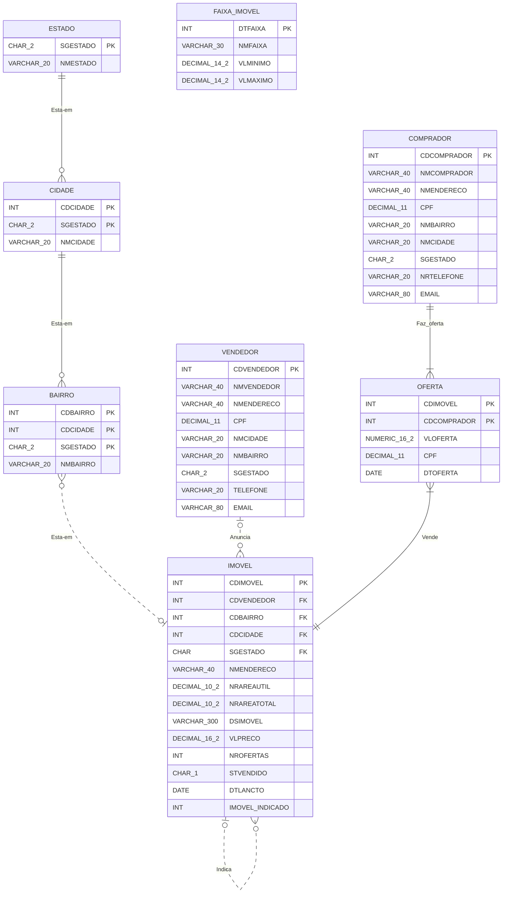

## Chapter 4 - Creating a Database

`Attention!` 
*Although our repository is largely in English, we will maintain the nomination of tables, attributes and values in the Portuguese standard, just as it is in the book.*

From this chapter on, our exercises will be about creating the physical model of the database. We will know in practice the syntax of the SQL language.

---

But, before we create any table, we already need to know how to define the data types and size of each field.

The book is rich in details at this stage, it is very easy to retain the information. But if you need it, we have a few notes that we use for queries in case of doubts: [Notes](../notes/Concept.md#creating-tables)

Let's get to the exercises. :nerd_face:

---

### Proposed exercises

#### 1.
**Create the tables and indexes for the following data model, including relationships and all referential integrity.**



##### REPLY
```
CREATE TABLE ESTADO (
    SGESTADO CHAR(2) NOT NULL,
    NMESTADO VARCHAR(20) NOT NULL,
    PRIMARY KEY (SGESTADO)
);

CREATE TABLE CIDADE (
    CDCIDADE INTEGER NOT NULL,
    SGESTADO CHAR(2) NOT NULL,
    NMCIDADE VARCHAR(20) NULL,
    PRIMARY KEY (CDCIDADE, SGESTADO),
    FOREIGN KEY (SGESTADO)
    REFERENCES ESTADO (SGESTADO)
);

CREATE TABLE BAIRRO (
    CDBAIRRO INTEGER NOT NULL,
    CDCIDADE INTEGER NOT NULL,
    SGESTADO CHAR(2) NOT NULL,
    NMBAIRRO VARCHAR(20) NULL,
    PRIMARY KEY (CDBAIRRO, CDCIDADE, SGESTADO),
    FOREIGN KEY (CDCIDADE)
    REFERENCES CIDADE (CDCIDADE),
    FOREIGN KEY (SGESTADO)
    REFERENCES ESTADO (SGESTADO)
);

CREATE TABLE FAIXA_IMOVEL (
    CDFAIXA INTEGER NOT NULL,
    NMFAIXA VARCHAR(30) NULL,
    VLMINIMO DECIMAL(14,2) NULL,
    VLMAXIMO DECIMAL(14,2) NULL,
    PRIMARY KEY (CDFAIXA)
);

CREATE TABLE VENDEDOR(
    CDVENDEDOR  INTEGER NOT NULL,
    NMVENDEDOR  VARCHAR(40) NULL,
    NMENDERECO  VARCHAR(40) NULL,
    NRCPF DECIMAL(11) UNIQUE,
    NMCIDADE VARCHAR(20) NULL,
    NMBAIRRO VARCHAR(20) NULL,
    SGESTADO CHAR(2) NULL,
    TELEFONE VARCHAR(20) NULL,
    EMAIL VARCHAR(80) NULL,
    PRIMARY KEY (CDVENDEDOR)
);

CREATE TABLE COMPRADOR(
    CDCOMPRADOR INTEGER NOT NULL,
    NMCOMPRADOR VARCHAR(40) NULL,
    NMENDERECO VARCHAR(40) NULL,
    NRCPF DECIMAL(11) UNIQUE,
    NMCIDADE VARCHAR(20) NULL,
    NMBAIRRO VARCHAR(20) NULL,
    SGESTADO CHAR(2) NULL,
    TELEFONE VARCHAR(20) NULL,
    EMAIL VARCHAR(80) NULL,
    PRIMARY KEY (CDCOMPRADOR)
);

CREATE TABLE IMOVEL (
    CDIMOVEL INTEGER NOT NULL,
    CDVENDEDOR INTEGER NULL,
    CDBAIRRO INTEGER NULL,
    CDCIDADE INTEGER NULL,
    SGESTADO CHAR(2) NULL,
    NMENDERECO VARCHAR(40) NULL,
    NRAREAUTIL DECIMAL(10,2) NULL,
    NRAREATOTAL DECIMAL(10,2) NULL,
    DSIMOVEL VARCHAR(300) NULL,
    VLPRECO NUMERIC NULL,
    NROFERTAS INTEGER NULL,
    STVENDIDO CHAR(1) NULL,
    DTLANCTO DATE NULL,
    IMOVEL_INDICADO INTEGER NULL,
    PRIMARY KEY (CDIMOVEL),
    FOREIGN KEY (CDVENDEDOR)
    REFERENCES VENDEDOR (CDVENDEDOR),
    CONSTRAINT IMOVEL_IMOVEL
    FOREIGN KEY (IMOVEL_INDICADO)
    REFERENCES IMOVEL (CDIMOVEL),
    FOREIGN KEY (CDBAIRRO)
    REFERENCES BAIRRO (CDBAIRRO),
    FOREIGN KEY (CDCIDADE)
    REFERENCES CIDADE (CDCIDADE),
    FOREIGN KEY (SGESTADO)
    REFERENCES ESTADO (SGESTADO)
);

CREATE TABLE OFERTA (
    CDIMOVEL INTEGER NOT NULL,
    CDCOMPRADOR INTEGER NOT NULL,
    VLOFERTA INTEGER NULL,
    DTOFERTA DATE NULL,
    PRIMARY KEY (CDIMOVEL, CDCOMPRADOR),
    FOREIGN KEY (CDIMOVEL)
    REFERENCES IMOVEL (CDIMOVEL),
    FOREIGN KEY (CDCOMPRADOR)
    REFERENCES COMPRADOR (CDCOMPRADOR)
);

```
&#xa0;

#### 2.
**Create indexes for (VENDEDOR.NMVENDEDOR and COMPRADOR.NMCOMPRADOR).**

##### REPLY
```
CREATE INDEX NMVENDEDOR ON VENDEDOR
    (NMVENDEDOR);

CREATE INDEX NMCOMPRADOR ON COMPRADOR
    (CDCOMPRADOR);
```

&#xa0;

#### 3.
**Create indexes for VENDEDOR.NMVENDEDOR (ascending) and COMPRADOR.NMCOMPRADOR (descending).**

##### REPLY
```
CREATE INDEX OFERTAIMOVEL ON OFERTA
    (CDIMOVEL ASC);

CREATE INDEX OFERTAVL ON OFERTA
    (VLOFERTA DESC);
```

&#xa0;

---

`NOTE:`

The answers to all the exercises in Chapter 4 are available in the file: [ImovelNet.sql](.../downloads/ImovelNet.sql).

**In all subsequent exercises, this data structure is used. Until the end of the book.**

As indicated by the book, the database name was defined as: `ImovelNet`.